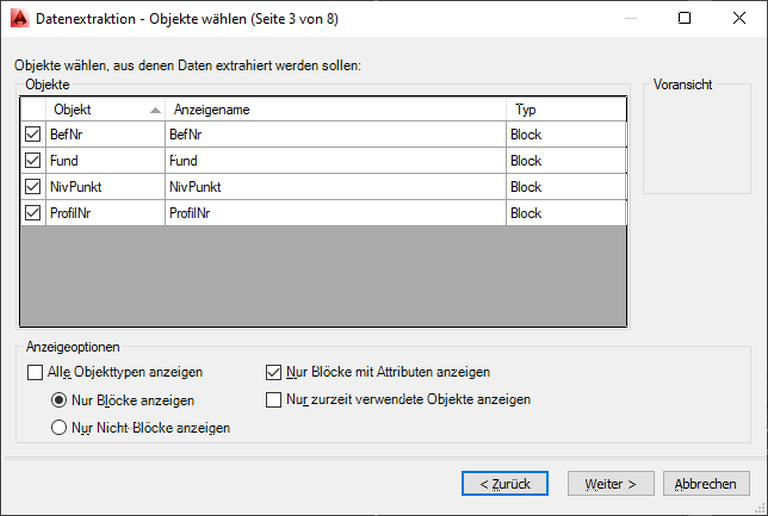
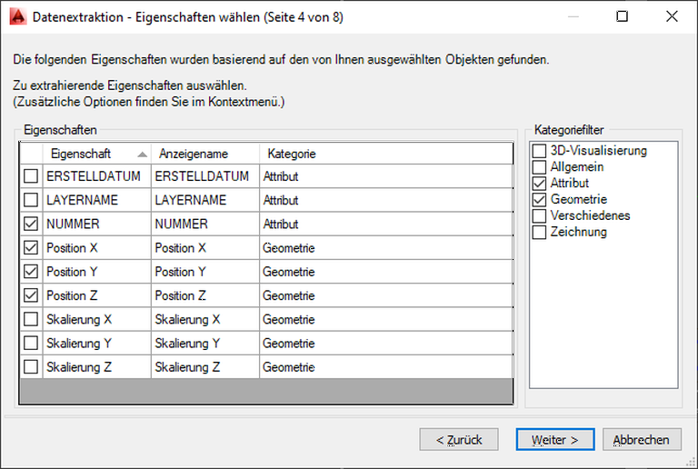

```{r setup, include=FALSE}
knitr::opts_chunk$set(echo = TRUE)
```

# Grundlegende Information

Aufgabenstellung: 

Sie möchten Standardaufgaben effizient ausführen, z.B. automatisch zählende Fundnummern, Ablage von Befundlinien auf dem richtigen Layer, problemloser Export von Koordinaten zu Befundnummern, Funden, Profilnägeln in Listen oder Textblöcke mit den Koordinaten einfügen.  

Lösung: Nutzen Sie die hier bereitgestellte LISP-Routine und passen Sie diese ggf. Ihren Bedürfnissen an.

Anmerkung: AutoCAD ist für Windows entwickelt und AutoLISP nutzt entsprechend konsequent den **Zeichensatz ANSI**.  

## Neuerungen dieser Version

Im Rahmen einer Übung wurde der lange nicht veränderte Code überarbeitet. Die Neuerungen sind:

- Alle Blöcke besitzen nun drei Attribute (Nummer, Erstelldatum, Layername). Für Erstelldatum und Layername werden Systemvariablen als Vorgabewerte genutzt. 
- Prüfung von Befund- und Fundnummern bei der Eingabe auf Dubletten. Dafür wird eine Liste geführt, die mit dem Befehl ```Attributliste \<Blockname>``` abgerufen und neu geschrieben werden kann.
- Mit ```maxBNR``` und ```maxFUN``` können die größte Befundnummer oder die größte Fundnummer zu einem Befund abgefragt werden. Die Rückgabe erfolgt in der Kommandozeile. Die Funktionen setzten die Verwendung von Zahlen für die Befund- und Fundnummern voraus. 
- Befund- und Fundnummern werden nur als Block eingefügt. Ein zusätzlicher Text für die freie Positionierung in der Zeichnung wird nicht mehr eingefügt. Damit entfallen die Vordefinierten Textstile mit Beschriftungsmaßstab.
- Mit "NUM" wird ein nummerierter Punkt (Block NumPunkt) eingefügt (z.B. Photogrammetrie). 
- Importierte Blöcke (wblock) werden auf die AutoCAD-Version geprüft (Kompatibilität).

## Unterstützte Aufgaben der Dokumentation in AutoCAD 

Dieser Text beschreibt ein Verfahren, um folgende Arbeitsschritte einer Ausgrabung in AutoCAD automatisiert auszuführen:

- Eine Befundnummer automatisch gezählt eintragen und mit einer Mittelpunktkoordinate des Befundes exportieren. Die Befundnummer wird auf Dubletten geprüft.
- Einzelfundmessung mit fortlaufender Fundzählung je Befundnummer und Koordinatenexport. Die Fundnummer wird auf Dubletten geprüft.
- Das Messen und automatische Beschriftung von Profilnägeln je Befund sowie Zeichnen der Profillinie.  Export der Profilnägel als Koordinatenliste.
- Eintragen von Niv.-Werten über einem Dreieck und Listenexport mit Koordinaten.
- Ein fortlaufend gezählte Nummer (NumPunkt) und Export  mit den Koordinaten.
- Ein Textblock mit den Koordinaten des zuerst markierten Punktes.
- Alle Objekte werden automatisch auf die entsprechenden Layer gelegt (z. B. SN01PL01_BefundNr). Wenn der erwartete Layer nicht existiert werden die Objekte auf dem aktuellen Layer angelegt.


## sample-start.dwg, sample-end.dwg und Blöcke
Es handelt sich um zwei Beispieldateien für das Testen der Funktionen (sample-start.dwg, sample-end.dwg, ACAD Ver. 2010).

Öffnen Sie eine der genannten Dateien. Im Layermanager oder im zugehörige Pull-Down-Menü sehen definierte Layer für das Planum 1 in Schnitt 1(SN01Pl01_Befund, …). Diese Vorgaben entsprechen der LISP-Routine LayerErstellen.lsp und können dort modifiziert werden.

Die Befehle greifen auf Blöcke mit Attribut zu, diese befinden sich im Ordner .\\blocks. Beachten Sie bitte die metrische Einheit "Meter", AutoCAD skaliert beim Import automatisch von oder zu Inch oder Millimeter. Kontrollieren Sie bei eigenen Dateien bitte die Einheit mit dem Befehl ```Einheit```. Jeder Block besitzt drei Attribute: 1. **Nummer** für die jeweilige Information, also Befund- oder Fundnummer, Niv.-Wert usw. 2. **Erstelldatum**, dieses wird automatisch aus dem Systemdatum übernommen. 3. **Layername** für den aktuellen Layer, er wird aus der Systemvariable *clayer* automatisch übernommen. Die Blöcke sind: 

- BefNr.dwg
- Fund.dwg
- NivPunkt.dwg
- NumPunkt.dwg
- Profilname.dwg
- ProfilNr.dwg

# Anwenden

## AutoLISP-Routine laden 

**appload**

Laden Sie das Programm ArchCAD.lsp mit dem Befehl ```appload```.  Wiederholen Sie dies nach jedem Programmstart oder fügen Sie das Programm mit "Inhalt…" der Startgruppe zu.

- \<Enter> wiederholt den letzten Befehl. Einige der folgenden Routinen zählen automatisch, Sie können diese also fortwährend „ab-entern“.
- Aus diesem Grund wird mit ArchCAD auch das Attributfenster für das Erfassen der Blockattribute deaktiviert: ```_attdia <0>/<1>```. 
-  	Mit \<F2> wird die Befehlszeile in einem eigenen Fenster geöffnet, die letzten Zeilen informieren über die Tastaturbefehle zum Starten der Routinen.


## Befundnummer messen 

**bnr**

Zeichnen Sie einen fiktiven Befund auf dem Layer „SN01Pl01_Befund“, ```3dp``` für 3D-Polylinie und schließen Sie den Befund zum Startpunkt mit ```s```.  Messen Sie nun die Befundnummer ein mit dem Befehl ```bnr```. In der Befehlszeile werden Sie aufgefordert, eine Befundnummer einzutragen oder den Vorgabewert "1" mit [Enter] zu akzeptieren. Nachfolgend werden Sie aufgefordert, den Mittelpunkt des Befundes zu messen. Danach steht die Zahl im Befund. 

- Die eingegebene Befundnummer ("1") wird auf Dubletten in der aktiven Zeichnung geprüft und ggf. eine Warnung ergänzt mit Messdatum und Layer ausgegeben.

Der Befehle ```_attdisp``` steuert die Sichtbarkeit der Attribute. Mit "**E**in" sehen Sie unter der Befundnummer nun die weiteren, sonst ausgeblendeten Attribute des Blockes. Dieser Block wird nachfolgend für eine Befundliste mit seinen Koordinaten exportiert. Schalten Sie die Attributansicht mit dem dt. Befehl ```attzeig``` wieder auf "**N**ormal".

Anmerkung: Bei der späteren Verwendung in einem GIS können der Block und die Plygonlinie über eine räumliche Abfrage verbunden werden (```within(geom1, geom2)``` oder ```touches(geom1, geom2)```) [SpatiaLite Funktionen](http://www.gaia-gis.it/gaia-sins/spatialite-sql-latest.html#p12). 

## Profil messen 

**prl**

Zeichnen bzw. messen Sie nun das Profil zum Befund ein mit ```prl```. Die zuletzt verwendete Befundnummer wird automatisch vorgegeben und kann mit \<Enter> bestätigt werden. Der folgenden Nagelnummern werden mit "1" beginnend automatisch gezählt und müssen dann gemessen werden. Die Zählung kann  jedes Mal verändert werden. Die Farbe der Objekte weist auf die Lage der einzelnen Objekte auf den entsprechenden Layern hin.

- Weitere Profilnägel werden fortlaufen nummeriert. In dieser Version beginnt die Zählung der Nägel bei jeder neuen Befundnummer wieder mit "1".
- Einen einzelnen Profilnagel messen Sie mir ```prn``` ein.

## Funde messen 

**fun**

Um Funde zu messen geben Sie bitte ```fun``` ein. Die zuletzt verwendete Befundnummer wird automatisch vorgeschlagen und kann mit \<Enter> bestätigt werden. Nachfolgend werden die Fundnummern gezählt. Die Fundnummer kann jedes Mal geändert werden. In dieser Version beginnt die Zählung der Fundnummer bei jeder neu eingegebenen Befundnummer mit "1".

- Die eingegebene Fundnummer ("\<Bef-Nr>-1") wird auf Dubletten in der aktiven Zeichnung geprüft und ggf. eine Warnung ergänzt mit Messdatum und Layer ausgegeben.
- Digitalisieren oder messen Sie Funde für maximale Effizienz möglichst fortlaufend. 

## Nivellierpunkt setzen 

**npt**

Messen Sie den Nivpunkt oder fangen Sie einen Punkt in der Zeichnung, der z-Wert wird aus dem Messwert vorgegeben und mit \<Enter> über einem kleinen Dreieck eingetragen.

- Sie können statt des ermittelten z-Wertes auch eigenen Text eintragen.

## Nummerierter Punkt 

**num**

Der nummerierte Punkt ist vor allem für Messbildentzerrung gedacht und als 3D-Würfel gestaltet. Entsprechend erfolgt die Zählung für jeden Befund ("\<Bef-Nr>/1") und startet nach der Eingabe einer neuen Befundnummer wieder mit "1".

- Die eingegebene Nummer ("\<Bef-Nr>/1") wird auf Dubletten in der aktiven Zeichnung geprüft und ggf. eine Warnung ergänzt mit Messdatum und Layer ausgegeben.

## Koordinatenbemaßung 

**kbm**

Koordinatenbemaßung ist in AutoCAD implementiert, hier wird aber der Bezug zum BKS-Ursprung hergestellt, wodurch bei ```Zoom``` ```Grenzen``` auch auf den Ursprung gezoomt wird. Zudem wird nur jeweils die x- oder die y-Koordinate eingefügt. Die Funktion ```kbm``` greift die Koordinaten des übergebenen Punktes ab und fügt einen MText mit den Koordinaten "x: nn.nn; y: nn.nn; z: nn.nn" ein. Hierbei wir der jeweils aktive Textstil verwendet. Die Textgröße richtet sich nach der ersten aufgezogenen Textbox oder kann jedes Mal neu bestimmt werden.

## Attributliste

**Attributliste** \<Blockname>

In der aktuellen Version werden Befundnummern ("1"), Fundnummern ("1-1") und nummerierter Punkt (NumPunkt "1/1") auf Dubletten in der aktiven Zeichnung geprüft und ggf. eine Fehlermeldung ausgegeben. Dafür wird eine Liste dieser Nummern geführt, die mit ``Àttributliste``` aktiv abgerufen und regeneriert werden kann wenn Blöcke aus der Zeichnung gelöscht wurden. Für die Blöcke sehen die Listen wie folgt aus.

| Block | Format | Beispiel |
|:------|:-----------------:|:------------------------------|
| BefNr | \<Nummer> \<Erstelldatum> \<Layername> ... | "1" "02/02/2022" "SN01PL01_BefundNr" "2" "02/02/2022" "SN01PL01_BefundNr" ... |
| Fund | \<Nummer> \<Erstelldatum> \<Layername> ... | "1-1" "02/02/2022" "SN01PL01_FundNr" "2-1" "02/02/2022" "SN01PL01_FundNr" ... |
| NumPunkt |  \<Nummer> \<Erstelldatum> \<Layername> ... | "1/1" "02/02/2022" "SN01PL01_FundNr" "2/1" "02/02/2022" "SN01PL01_FundNr" ... |

# Export der Blöcke und Attribute

  **datenextrakt** 

Sie können Blöcke mit deren Attributen und weiteren Eigenschaften in eine CSV-Datei exportieren. Den Vorgang finden Sie im Menü unter "Extras > Datenextraktion".

| Auswahl der Blöcke | Auswahl der Attribute |
|:------------------------------------:|:------------------------------------:|
|  |  |

Mit dem Befehl ```datenextrakt``` starten Sie die Extraktion. Die folgenden Schritte unterscheiden sich in den Versionen von AutoCAD. Erstellen Sie eine "Neue Datenextraktion erstellen" und speichern Sie diese bei Bedarf. Wählen Sie nachfolgend die aktuelle Zeichnung. In den folgenden Fenstern können Sie die Anzahl der zu extrahierenden Objekte filtern, wählen Sie "Nur Blöcke anzeigen" und "Nur Blöcke mit Attribut anzeigen". Wählen Sie anschließend die zu extrahierenden Blöcke. Im folgenden Fenster können sie weiter Angaben filtern um die Auswahl einschränken, wählen Sie die Attribute der Blöcke (Nummer, Erstelldatum, Layername) und aus der Geometrie die Felder "Position X",  "Position Y" und  "Position Z" aus. Wählen Sie abschließend die Ausgabe in eine Datei und wählen Sie **unbedingt CSV als Format** aus, um das Punkt-Komma-Problem zu vermeiden.      

# Struktur des Codes und kurze Erläuterung 

Der Code gliedert sich in vier Hauptabschnitte: 

- Definition allgemeiner Variablen, diese können nach Bedarf zusammen mit den Blöcken und der Funktion Layererstellen.lsp angepasst werden (Name der Layer, Name der Blöcke mit Attribut, Textstile).
- Lokale Funktionen für diverse, wiederholt benötigte Aufgaben.
- Die neuen Befehle als lokale Funktionen.
- Die Zuweisung der lokalen Funktionen an die globalen, in AutoCAD aufrufbaren Befehle.

Der Code ist auf Englisch weitgehend kommentiert und damit nachvollziehbar. Für den Einstieg und als Beispiel wird nachfolgend der Code für das Einfügen der Befundnummer in Ausschnitten erläutert.

```{}
;;====================================================
;;; Insert the block for a feature number (BefNr)
;;;===================================================
  (defun BefundNr ( / BefNr_opt pt1)
    (setq	BefNr_opt
  	 (getstring
  	   (strcat "\nBefund-Nr. eingeben <" (add2Text 1 BefNr) ">:")))
```

Nach dem Funktionsnamen und den internen Variablen wird ab der zweiten Zeile der Variablen für die optionale nächste Befundnummer (BefNr_opt) ein Wert zugewiesen. Von Innen nach Aussen in einzelnen Schritten:

```(add2Text 1 BefNr)```

Die Funktion add2Text findet sich bei den lokalen Funktionen, wandelt eine als Text definierte Zahl in eine Zahl um und addiert in diesem Fall eine 1. Da der Variablen BefNr *a priori* der Wert "0" zugewiesen wurde ergibt sich als neuer Wert "1". Der Rückgabewert ist erneut ein Text und kann mit ```strcat``` erneut verarbeitet werden.

```(strcat "\nBefund-Nr. eingeben <" (add2Text 1 BefNr) ">:")```

Die Funktion strcat verbindet alle Elemente und übergibt diese als Nutzeraufforderung an die Funktion ```getstring```. Mit "\\n" wird einleitend ein Zeilenumbruch eingefügt.

```(setq BefNr_opt (getstring ...))```

Weist der Variablen den Rückgabewert von getstring zu.

```{}
(if (= BefNr_opt "")
  (setq BefNr (add2Text 1 BefNr))
  (setq BefNr BefNr_opt)
)
```

Die Funktion ```if``` prüft, ob "BefNr_opt" ein Wert zugewiesen wurde. Ist diese Variable leer (TRUE), war der Nutzer mit der Vorgabe von ```(add2Text 1 BefNr)``` einverstanden, der Wert wird nachfolgend der Variablen BefNr zugewiesen. Alternativ wird die Nutzereingabe als neuer Wert der Variablen BefNr zugewiesen.

```(setq Nagel "0" FundNr "0")```
      
Da der Nutzer jetzt einen neuen Befund bearbeitet wird die Zählung für die Profilnägel und Funde auf "0" gesetzt. In der neuen Version folgt die Prüfung auf vorhandene Dubletten, er wird hier nicht erläutert. 

```(setq oldlay (getvar "clayer"))```
```(changeLayer (strcat (getPrefix oldlay) LayBefNr))```

Der aktuelle Layer wird der Variable oldlay zugewiesen. Die Funktion getPrefix findet sich bei den lokalen Funktionen, der Rückgabewert ist der Anfang eines String bis zum "_", z.B. "SN01PL01_". Zusammen mit dem Inhalt der Variable LayBefNr liefert die Funktion strcat den zu verwendenden Layernamen "SN01PL01_BefundNr". Die Funktion changeLayer findet sich bei den lokalen Funktionen, sie prüft die Existenz eines Layers und wechselt zu diesem. 

```(setq pt1 (getpoint "\nBefund Mittelpunkt messen: "))```

Fordert den Nutzer auf einen Punkt anzugeben, die Rückgabe wird pt1 zugewiesen.

```{}
(if (tblsearch "block" blkBNR)
  (command "_insert" blkBNR pt1 "1" "1" "0" BefNr (TODAY) (clayer))
  (command "_insert" (getWBlock blkBNR) pt1 "1" "1" "0" BefNr (TODAY) (clayer))
)
```

Die Funktion ```if``` prüft, ob der Wert der Variable blkBNR in der Liste der Blöcke der Zeichnung vorliegt. Wenn ja, wird der Block am Punkt pt1 eingefügt. Es folgen die Skalierung auf der x- und y-Achse, die Rotation und die Werte für die Attribute des Blocks: BefNr, die Rückgabe der Funktion TODAY (s. lokale Funktionen) und die Systemvariable CLAYER. Anderenfalls wird die Funktion getWBlock aufgerufen und der Nutzer muss den Block noch laden. Dieser letzte Abschnitt wurde in der neuen Version um eine Prüfung der Datei-Version des zu ladenden Blockes (wblock) erweitert und sieht dadurch etwas komplexer aus. 

```{}
;(command "_text" "Stil" txtBNR100 pt1 "0" BefNr)
 (command "_layer" "set" oldlay "")
);Ende Defun BefundNr
```

In der vorangehenden Version wurde die Befundnummer auch als Text eingefügt.Um Redundanzen und Verwirrung zu vermeiden wurde dies auskommentiert. Danach wird auf den alten Layer gewechselt.

Die übrigen Funktionen sind sehr ähnlich aufgebaut.
