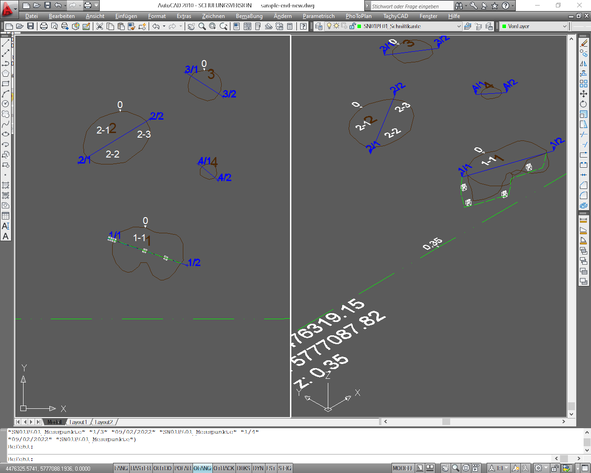

##Tools für die Dokumentation von archäologischen Ausgrabungen mit AutoCAD##

Aufgabenstellung: 

Sie möchten Standardaufgaben effizient ausführen, z.B. automatisch zählende Fundnummern, Ablage von Befundlinien auf dem richtigen Layer, problemloser Export von Koordinaten zu Befundnummern, Funden, Profilnägeln in Listen oder Textblöcke mit den Koordinaten einfügen.  

Lösung: 

Nutzen Sie die hier bereitgestellte LISP-Routine und passen Sie diese ggf. Ihren Bedürfnissen an.

###1.	Unterstützte Aufgaben der Dokumentation  in AutoCAD###

Dieser Text beschreibt ein Verfahren, um folgende Arbeitsschritte einer Ausgrabung in AutoCAD automatisiert auszuführen:

- Befundnummer automatisch gezählt eintragen und mit einer Mittelpunktkoordinate des Befundes exportieren
- Einzelfundeinmessung mit fortlaufender Fundzählung je Befundnummer und Koordinatenexport
- Einmessen und automatische Beschriftung von Profilnägeln je Befund sowie Zeichnen der Profillinie.  Export der Profilnägel als Koordinatenliste.
- Flächennivellements mit Niv.-Wert über Dreieck und Listenexport mit Koordinaten
- Textblock  mit den Koordinaten des markierten Punktes (Koordinatenbemaßung ohne den unangenehmen Effekt bei „zoom“ „Grenzen“ den Koordinatenursprung mit einzubeziehen)
- Alle Objekte werden automatisch auf ihre entsprechenden Layer gelegt (z. B. SN01PL01_BefundNr). Wenn der Layer nicht existiert, werden sie auf dem aktuellen Layer angelegt.

###2. sample-start.dwg & sample-end.dwg###
Es handelt sich um zwei Beispieldateien für das Testen der Funktionen (sample-start.dwg, sample-end.dwg, ACAD Vers. 2000).

Öffnen Sie eine der genannten Dateien. Im Layermanager oder im zugehörige Pull-Down-Menü sehen definierte Layer für das Planum 1 in Schnitt 1(SN01Pl01_Befund, …). Diese Vorgaben entsprechen der LISP-Routine LayerErstellen.lsp und können dort modifiziert werden.

Die Befehle greifen auf Blöcke mit Attribut zu, diese befinden sich im Ordner [./blocks](./blocks). Beachten Sie Bitte die metrische Einheit "Meter", AutoCAD skalliert beim Import automatisch zu Inch oder Millimeter.

- BefNr.dwg
- Fund.dwg
- NivPunkt.dwg
- NumPunkt.dwg
- Profilname.dwg
- ProfilNr.dwg

###3.	AutoLISP-Routine laden###

	appload

Laden Sie das Programm ArchCAD.lsp mit dem Befehl „appload“.  Wiederholen Sie dies nach jedem Programmstart oder fügen Sie das Programm mit [Inhalt…] der Startgruppe zu.
 
-  	<kbd>Enter</kbd> wiederholt den letzten Befehl. Einige der folgenden Routinen zählen automatisch, Sie können diese also fortwährend „abentern“.
-  	Mit <kbd>F2</kbd> wird die Befehlszeile in einem eigenen Fenster geöffnet, die letzten Zeilen informieren über die Tastaturbefehle zum Starten der Routinen.

###4.	Befundnummer einmessen und extrahieren.###

	bnr

Zeichnen Sie einen fiktiven Befund auf dem Layer „SN01Pl01_Befund“, „3dp“ für 3D-Polylinie und schließen Sie den Befund zum Startpunkt mit „S“.  Messen Sie nun die Befundnummer ein mit dem Befehl „bnr“. In der Befehlszeile werden Sie aufgefordert, eine Befundnummer einzutragen oder den Vorgabewert "1" mit <kbd>Return</kbd> zu akzeptieren. Nachfolgend werden Sie aufgefordert, den Mittelpunkt des Befundes zu messen. Danach steht die Zahl im Befund. 

	_attdisp
	attzeig
Die Befehle steuern die Sichtbarkeit der Attribute. Mit "Ein" sehen sehen Sie die Befundnummer nun doppelt, dies ist Absicht. Die große Befundnummer ist ein Text, den sie frei verschieben oder auch löschen können, die kleine Befundnummer ist bei der Option "Normal" ausgeblendet und stellt das Attribut eines Blocks dar.  Dieser Block wird nachfolgend für eine Befundliste mit Koordinaten exportiert. Schalten Sie die Attributansicht „attzeig“ wieder auf "Normal".

 **GIS** 

Wenn Sie den Block der Befundnummer auf die Befundlinie oder in den Befund setzen, können Sie in einem GIS mit einem räumlichen Join das Polygon oder die Befundlinie und die Nummer des Attributs verbinden. Im Ergebnis haben Sie einen Layer für die Verbindung zur Befunddatenbank.

	_dataextraction
	datenextract

**Export**

Sie konnen Blöcke mit Attribute und zahlreiche weiteren Eigenschaften in eine [CSV-Datei](./samples/sample-export-blocks.txt) exportieren. 

Zum Extrahieren der Befundnummer mit ihren zugehörigen Koordinaten geben Sie bitte den Befehl „datenextrakt“ ein. Die nachfolgenden Schritte unterscheiden sich in den Versionen von AutoCAD etwas. Wählen Sie „Neue Datenextraktion erstellen“, Sie können diese für spätere Verwendung speichern. Wählen Sie im folgenden Fenster die aktuelle Zeichnung.  Die Auswahl im folgenden Fenster mit den Anzeigeoptionen in der unteren Hälfte: wählen Sie hier „Nur Blöcke anzeigen“ und „Nur Blöcke mit Attributen anzeigen“. In der oberen Hälfte wird der Block „BefNr“ angezeigt und muss ausgewählt werden. Im nächsten Fenster können Sie die mit dem Block verbundenen Parameter wählen. Relevant ist aus dem Bereich Attribut das Feld „Nummer“ und aus dem Bereich Geometrie die Felder „Position X“, „Position Y“ und „Position Z“. Die Optionen des nächsten Fensters sind vorerst uninteressant. Wählen Sie abschließend die Ausgabeoption in eine externe Datei Ihrer Wahl. 

- Wählen Sie CSV oder beachten Sie bei einem Export zu MS Excel das Punkt-Komma-Problem!

###5.	Profil einmessen###

	prl

Zeichnen bzw. messen Sie nun das Profil zum Befund ein mit „prl“. Die zuletzt verwendete Befundnummer wird automatisch vorgegeben und kann mit <kbd>Return</kbd> bestätigt werden. Der erste Nagel erhält die Nummer "1" und wird eingemessen. Der nächste Nagel erhält die "2" und wird eingemessen. Die Farbe der Objekte weist darauf hin, dass diese direkt auf dem richtigen Layer angelegt wurden. 

- Weitere Profilnägel werden fortlaufen nummeriert. In dieser Version beginnt die Zählung der Nägel bei jeder neuen Befundnummer wieder mit „1“. 
- Der Export der Nagelbezeichnungen und Koordinaten erfolgt entsprechend den Befundnummern.

###6.	Funde einmessen###

	fun

Um Funde einzumessen geben Sie bitte „fun“ ein. Die zuletzt verwendete Befundnummer wird automatisch vorgeschlagen und kann mit [Return] bestätigt werden. Nachfolgend werden die Fundnummern gezählt. Wollen Sie mit einer anderen Zahl starten, geben Sie diese bitte ein. In dieser Version beginnt die Zählung der Fundnummer bei jeder neu eingegebenen Befundnummer mit „1“.

- Digitalisieren oder messen Sie Funde für maximale Effizienz möglichst fortlaufend. 
- Der Export der Fundnummern und Koordinaten erfolgt analog den Befundnummern.

###7.	Nivellierpunkt setzen###

	npt

Ein Befehl, der aus der von Hand erstellten Dokumentation abgeleitet ist und ursprünglich für das digitalisieren von Handzeichnungen gedacht war, ist das Zeichnen von Niv-Punkten mit „npt“. Messen Sie den Nivpunkt, der z-Wert wird aus dem Messwert vorgegeben und mit <kbd>Return</kbd> über einem kleinen Dreieck eingetragen.

- Der Export der Nicpunkte erfolgt analog den Befundnummer.
- Sie können statt des Z-Wertes eigenen Text eintragen und erhalten im Export eine Liste mit x-, y- und z-Koordinate.

###8.	Koordinatenbemaßung###

	kbm

Koordinatenbemaßung ist in AutoCAD implementiert, hier wird aber der Bezug zum BKS-Ursprung hergestellt, wodurch bei „Zoom“ „Grenzen“ auch auf den Ursprung gezoomt wird. Zudem wird nur jeweils die x- oder die y-Koordinate eingefügt. Die Funktion „kbm“ greift die Koordinaten des übergebenen Punktes ab und fügt einen MText mit den Koordinaten „x: nn.nn; y: nn.nn; z: nn.nn“ ein. Hierbei wir der jeweils aktive Textstil verwendet.

###9. Struktur des Codes und kurze Erläuterung ###

Der Code gliedert sich in vier Hauptabschnitte: 

- Definition allgemeiner Variable, diese können nach Bedarf zusammen mit den Blöcken und der Funktion Layererstellen.lsp angepasst werden (Name der Layer, Name der Blöcke mit Attribut, Textstile).
- Lokale Funktionen für diverse wiederholt benötigte Aufgaben.
- Die neuen Befehle als lokale Funktionen.
- Die Zuweisung der lokalen Funktionen an die globalen, in AutoCAD aufrufbare Funktionen.

Beispielhaft wird nachfolgend der Code für das Einfügen der Befundnummer erläutert. Der Code beginnt jeweils mit einem auskommentierten Titel

    ;;====================================================
    ;;;Fügt einen Block mit Attribut (BefNr) und einen Text (BefNr) ein.
    ;;;===================================================
    (defun BefundNr ( / BefNr_opt pt1)
      (setq	BefNr_opt
    	 (getstring
    	   (strcat "\nBefund-Nr. eingeben <" (add2Text 1 BefNr) ">:")))

Nach der Namenszuweisung und den internen Variablen wird Variable für die optionale nächste Befundnummer (BefNr_opt) ein Wert zugewiesen. Von innen nach Außen in einzelnen Schritten:

	(add2Text 1 BefNr)

Die Funktion add2Text findet sich bei den lokalen Funktionen, wandelt Text in Zahl die übergebenen Parameter in Zahlen und addiert diese. Der Variable BefNr wurde in der Variablendefinition erstmals "0" zugewiesen. Das Resultierende Ergebnis ist: "1"

	(strcat "\nBefund-Nr. eingeben <" (add2Text 1 BefNr) ">:")

Die Funktion strcat verbindet alle Elemente und hängt Sie als Nutzeraufforderung and die Funktion getstring. "\n" Fügt einleitend einen Zeilenumbruch ein.

	(setq BefNr_opt (gestring ...))

Weist der Variable den Rückgabewert von getsring zu.

      (if (= BefNr_opt "")
        (setq BefNr (add2Text 1 BefNr))
        (setq BefNr BefNr_opt)
      )

Die Funktion if prüft, ob BefNr_opt ein Wert zugewiesen wurde. Ist sie leer (TRUE), war der Nutzer mit der Vorgabe (add2Text 1 BefNr) einverstanden, der Wert wird nachfolgend der Variable BefNr zugewiesen. Alternativ wird die Nutzereingabe als neuer Wert BefNr zugewiesen.

      (setq Nagel "0" FundNr "0")
Da der Nutzer jetz einen neuen Befund bearbeitet wird die Zählund für Profilnägel und Funde auf "0" gesetzt.

      (setq oldlay (getvar "clayer"))
      (changeLayer (strcat (getPrefix oldlay) LayBefNr))

Der aktuelle Layer wird der Variable oldlay zugewiesen. 

Die Funktion getPrefix findet sich bei den lokalen Funktionen, Rückgabewert ist der Anfang eines String bis zum "_", z.B. "SN01_PL01_". Zusammen mit dem Inhalt der Variable LayBefNr liefert die Funktion strcat den Layernamen "SN01_PL01_BefundNr". 
Die Funktion changeLayer findet sich bei den lokalen Funktionen, sie prüft die Existenz eines Layers und wechselt zu diesem. 

      (setq pt1 (getpoint "\nBefund Mittelpunkt messen: "))

Fordert den Nutzer auf einen Punkt anzugeben, der Rückgabewert wird pt1 zugewiesen.

      (if (tblsearch "block" blkBNR)
        (command "_insert" blkBNR pt1 "1" "1" "0" BefNr (TODAY))
        (command "_insert" (getWBlock blkBNR) pt1 "1" "1" "0" BefNr (TODAY))
      )

Die Funktion if prüft, ob der Wert (Blockname) in der Variable blkBNR in der Liste der Blöcke der Zeichnung vorliegt. Wenn ja, wird der Block am Punkt pt1 eingefügt. Es folgen die Skallierung auf der x- und y-Achse, die Rotation und die Werte für die beiden Attribute des Blocks: Variable BefNr und die Rückgabe der Funktion TODAY (s. lokale Funktionen).

      (command "_text" "Stil" txtBNR100 pt1 "0" BefNr)
      (command "_layer" "set" oldlay "")
    );Ende Defun BefundNr

Nachfolgend wird die Befundnummer als Text eingefügt und zurück auf den alten Layer gewechselt.

Die übrigen Funktionen sind sehr ähnlich aufgebaut und im Code kommentiert.