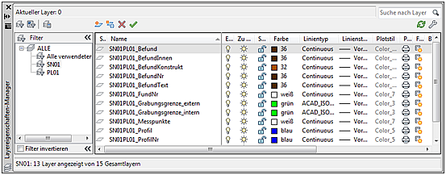

##Normierte Layer erstellen in AutoCAD##

Es handelt sich um eine leicht überarbeitete Version eines älterern Tutorials.

Problem: Sie möchten durch normierte Layer Ihre AutoCAD-Dateien strukturieren und für jedes Planum nicht alle Layer von Hand anlegen.

Lösung: Nutzen Sie die hier bereitgestellte LISP-Routine und passen Sie diese Ihren Bedürfnissen an.

###1.	Strukturierung durch Layer und Layerfilter in AutoCAD###

Die digitale Dokumentation einer archäologischen Ausgrabung in AutoCAD sollte möglichst stringent und klar gegliedert erfolgen. Dies wird unter anderem mit schematischen Layernamen erreicht, welche den effizienten Einsatz der Layerfilter erlauben. Für größere Projekte sollte zudem mit externen Referenzen zur Strukturierung der Daten gearbeitet werden. 

Ziele sind:

- die eigene Arbeit zu erleichtern
- die Einarbeitung späterer Bearbeiter zu erleichtern 
- die Archivierung, die Interoperabilität und das Retrieval zu verbessern

Die nachfolgende Funktion legt für jedes Planum und optional auch jeden Schnitt ein eigenes Layerpaket an. Die hier vorgegebenen Layer sind das Ergebnis einer mehrjährigen Großgrabung und eingehenden Diskussion mit zahlreichen Kollegen. Die Funktion muss mit dem Befehl appload nach dem Start von AutoCAD geladen werden und steht dann zur Verfügung. Nach dem Aufruf mit „Layererstellen“ kann die Schnittnummer angegeben werden, erfolgt keine Eingabe entfällt diese Angabe im Layernamen. Nachfolgend ist das Planum anzugeben für das die Layer angelegt werden sollen. Das Ergebnis sieht wie folgt aus: SN01PL01_Befund. Aufgrund der stereotypen Nomenklatur können leicht Filter zu unterschiedlichen Kriterien erstellt werden.
 

Abb. 1 Automatisch erstellte Layer mit normierten Namen.

###2.	Die AutoLISP Routine###

Die Funktion gliedert sich in eine Layerliste die sie jederzeit verändern können, eine Funktion für das Erstellung der Layer, die Nutzereingabe und den abschließenden Aufruf der Funktion mit der Liste der Parameter. Die Layerliste „LayerListe“ ist als geschachtelte Liste gestaltet, jeder Eintrag in einer Zeile stellt wiederum eine Liste der Eigenschaften für den Layer dar: Name, Farbe, Linientyp. Durch das tabellarische Layout ist das Anpassen an die eigenen Bedürfnisse bewusst deutlich erleichtert. Ein Anfügen oder Löschen von Layern ist ohne Weiteres möglich. Das Ergänzen von Eigenschaften ist für eine vierte Spalte vorbereitet, hierzu müssen in der Funktion LayerNeu die einleitenden „;“ der beiden entsprechend gekennzeichneten Zeilen entfernt werden. 

**Hier die aktuelle Liste der Layer:**

     ;Liste der zu erstellenden Layer und deren Eigenschaften
     (setq LayerListe
       '(
    	 ;Name			FarbNr	Linientyp	optSpalte4
    	 ("Befund" 		"36" 	"Continuous")
    	 ("BefundInnen"		"36"	"Continuous")
    	 ("BefundNr" 		"36" 	"Continuous")
    	 ("BefundText" 		"36" 	"Continuous")
    	 ("BefundKonstrukt" 	"32" 	"Continuous")
    	 ("FundNr" 		"7" 	"Continuous")
    	 ("Profil" 		"5" 	"Continuous")
    	 ("ProfilNr" 		"5" 	"Continuous")
    	 ("Schnittkante" 	"3" 	"ACAD_ISO02W100")
    	 ("SchnittNr" 		"3" 	"Continuous")
    	 ("Grabungsgrenze_intern" "3" 	"ACAD_ISO10W100")
    	 ("Grabungsgrenze_extern" "3" 	"ACAD_ISO12W100")
    	 ("Messpunkte" 		"7" 	"Continuous")
    	)
     )

Eine mögliche Änderung könnte eine Namensänderung sein und das Auskommentieren mit ";" überflüssiger Layer (Zeilen)

     (setq LayerListe
       '(
    	 ;Name			FarbNr	Linientyp	optSpalte4
    	 ("Befund" 		"36" 	"Continuous")
    	 ("BefundStruktur"		"36"	"Continuous") ; Name geandert
    	 ("BefundNr" 		"36" 	"Continuous")
    	 ;("BefundText" 		"36" 	"Continuous")
    	 ;("BefundKonstrukt" 	"32" 	"Continuous")
    	 ("FundNr" 		"7" 	"Continuous")

**Standardisirtes Präfix beim Layernamen mit Schnitt und Planum:** 

     ;Praefix für die Layernamen erstellen
     (setq Schnitt(getstring "\nSchnittnummer eingeben oder leer lassen: "))
     (if (/= Schnitt "")
       (if (= (strlen Schnitt) 1)
         (setq Schnitt (strcat "0" Schnitt))
       )
     )
      
     (setq Planum (getstring "\nNummer des Planums eingeben:"))
      (if (= (strlen Planum) 1)
        (setq Planum (strcat "0" Planum))
     )
      
     (if (/= Schnitt "")
        (setq Praefix (strcat "SN" Schnitt "PL" Planum "_"))
        (setq Praefix (strcat "PL" Planum "_"))
     )

Im ersten Abschnitt wird der Nutzer nach der Schnittnummer gefragt, ist diese nur ein Zeichen lang ("2") wird "0" ergänzt ("02").

Selbes erfolgt beim Planum.

Im dritten Abschnitt werden beide Zeichenketten zum Präfix verbunden ("SN02PL01_") oder nur "PL01_" vergeben, wenn Schnitt nicht angegeben wurde.

Bitte beachte Sie: Jede Zeichenfolge ist gültig, es erfolgt keine Prüfung der Eingabe.

**Die lokale Funktion für das Erstellen eines Layers**

     (Defun LayerNeu (LayerProperties)
      (command "_layer"
    	   "Neu"
    	   (strcat Praefix (car LayerProperties))
    	   "FArbe"
    	   (cadr LayerProperties)
    	   (strcat Praefix (car LayerProperties))
    	   "Ltyp"
    	   (caddr LayerProperties)
    	   (strcat Praefix (car LayerProperties))
    	   ;(cadddr LayerProperties) ;für die optSpalte4
    	   ""
      )
      (princ)
     )

An die Funktion wird eine Liste der Layereigenschaften übergeben, es handelt sich um die jeweilige Liste der Eigenschaften (eine Zeile) aus der Gesamtliste aller Layer (LayerListe). Für den AutoCAD-Befehl "_layer" werden nachfolgend die Befehle "Neu", "Farbe" und "Ltyp" aufgerufen. Für "Neu " werden das Präfix (s.o.) und das erste Element der Liste (Name) verbunden. Für die "Farbe" und "Ltyp" jeweiliges der zweite und dritte Wert der Liste und erneut Präfix & Name.

Wenn Sie weitere Attribute vergeben wollen, z.B. unsichtbar oder gesperrt, fügen Sie die Werte in der Layerliste für alle Layer ein und entfernen Sie ";" vor "(cadddr..." und "(strcat...". Eine letztes Element der Eigenschaftenliste kann mit "(last LayerProperties) abgerufen werden.
Das "" am Ende beendet den Befehl "_layer".

**Das Erstellen alle Layer**

     ;Ruft Funktion LayerNeu auf für jedes Element der Liste.
      (mapcar 'LayerNeu LayerListe)

Die Lisp-Funktion mapcar ruft eine Funktion, hier die lokale Funktion LayerNeu, für jedes Element einer Liste, hier LayerListe, auf. 

**Problem:**

Da einige Layernamen sehr ähnlich sind, meldet AutoCAD „nicht abgestimmte Layer“, moniert also fälschlich gerade jene feinen Unstimmigkeiten, die mit dieser Routine bereinigt werden. 
Lösung: Deaktivieren Sie die Prüfung in AutoCAD mit LAYERNOTIFY = 0 
